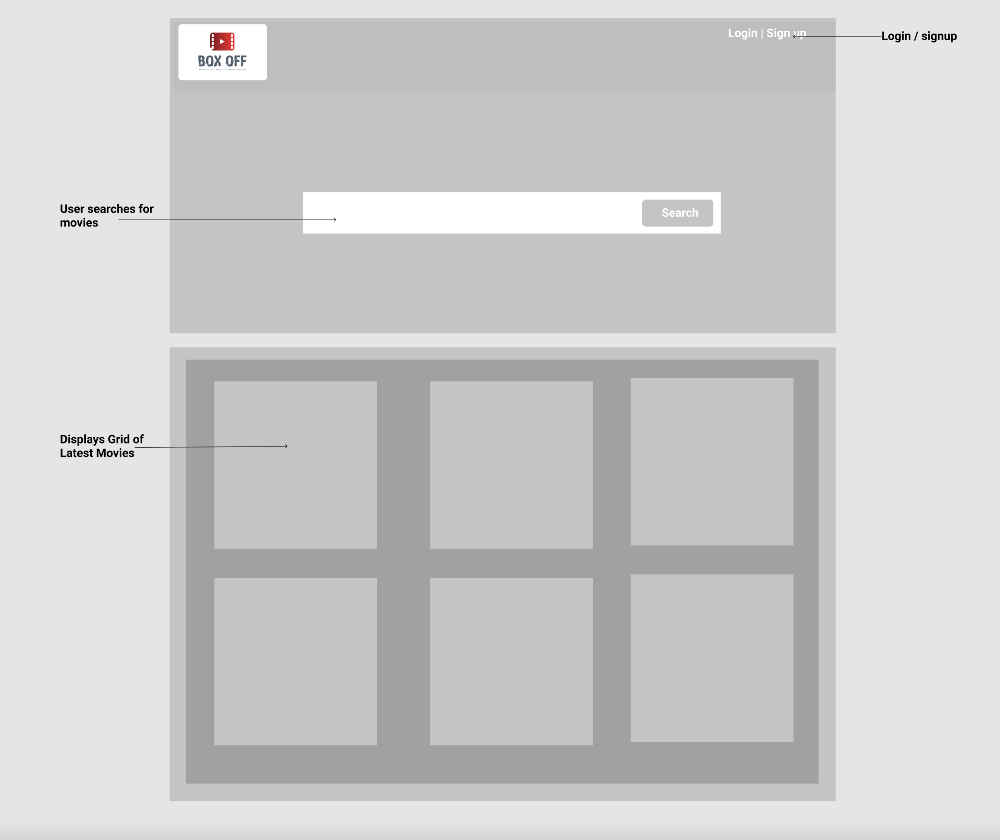
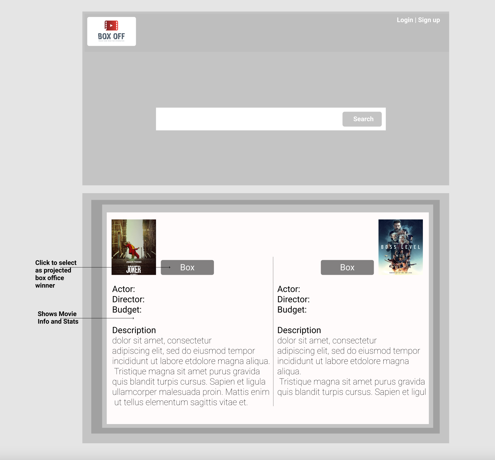
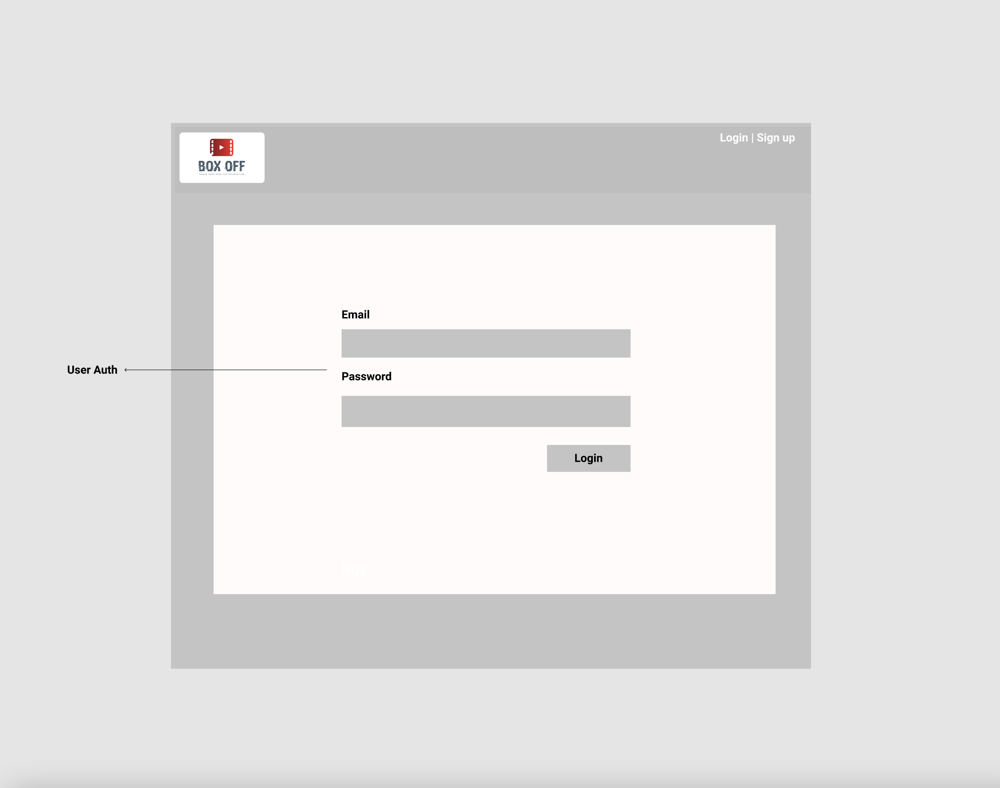
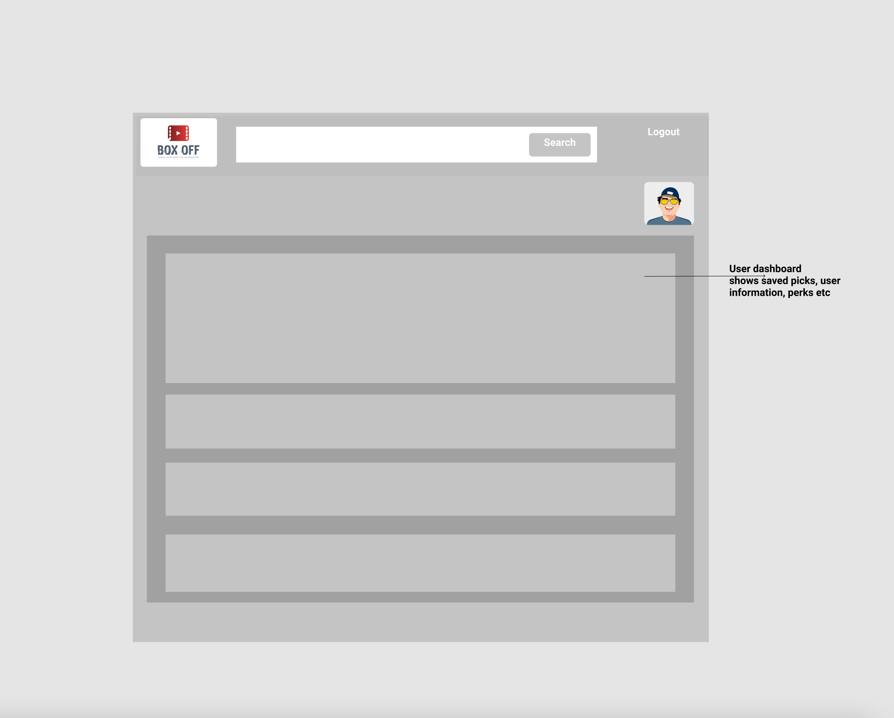
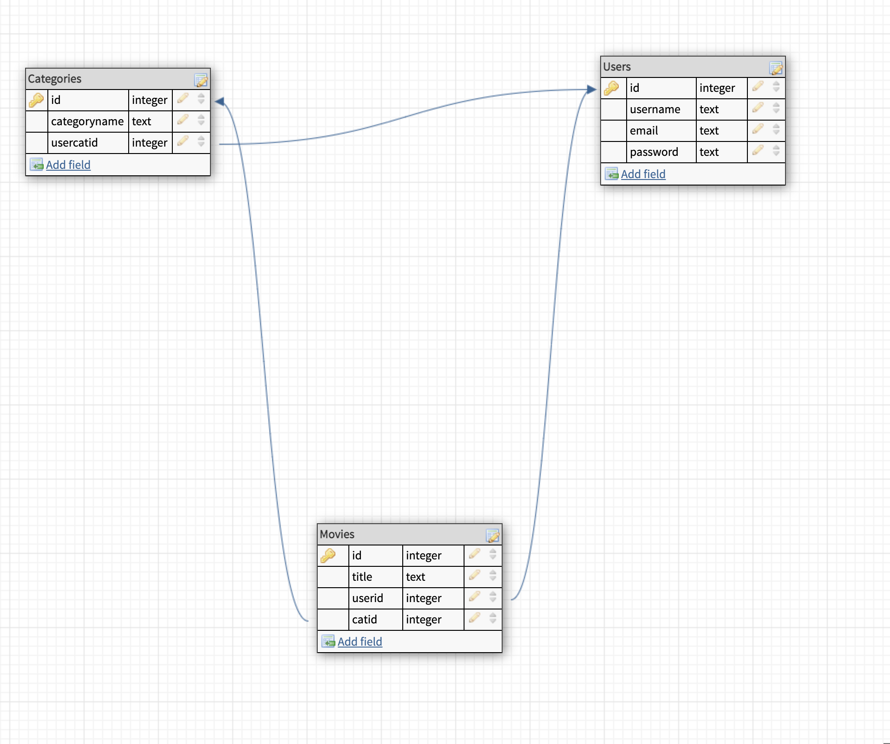
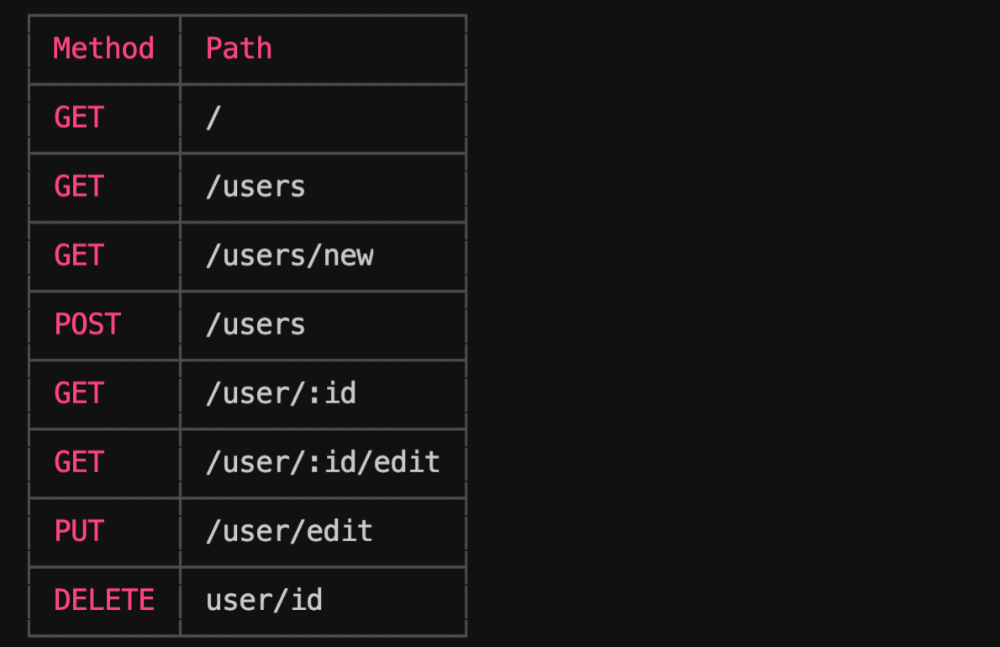

# Project Two

**Description**
---
**BoxOff** is an app that amongst other things recommend what to watch to it' users. The recommendation is based on few factors 

1. Weather
2. Seasons
3. User location
4. State of affairs
5. Actors standing in the industry

The app is based off an API provided The Movie Database
- TMDB -
[TMDB](https://www.themoviedb.org/)

**User stories**  
---
    App user(s)
        - User(s) are able to visit the site and run searches based on moods (Sad | Happy | Lonely etc).
        - User(s) can select to watch movies from recommended movie suggestions.
        - User(s) can personalize based on personal state of affairs after creating an account.
        - Upon selection, users will be given option to re-direct to streaming service company 
        - In order to participate, user(s) must establish accounts to gain full access

**Technologies used (including APIs)**
---
- This is a Node / Express app that fetches data using [TMDB](https://www.themoviedb.org/) and [Box Office Mojo](https://www.boxofficemojo.com//) API resources. 
- Database - ProgreSQL.
- Node.js ORM - Sequelize.

**MVP goals**
---
* Setup app with fetches to API.
* Ability to create user account and login.

**Stretch goals**
---
- Ability to Search for movies
- Email notification - To let users know who wins
- Saving user info to db via user accounts

**Wireframes**
---

**Database ERD**
---

**RESTful routing chart**
---

**Installation**

- nodemon index.js